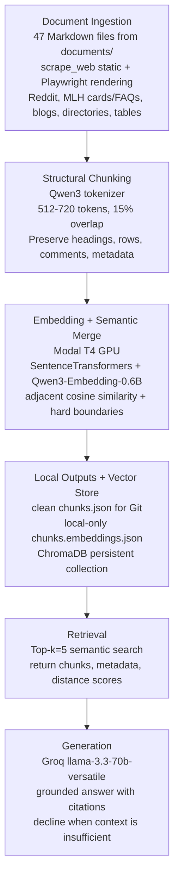

# Project 1 Planning: The Unofficial Guide

> Write this document before you write any pipeline code.
> This spec and architecture diagram will be used to direct AI tools to generate implementation code. Update the Retrieval Approach and Chunking Strategy sections if the implementation changes.

---

## Domain

My domain is hackathon meta-knowledge for students: how to get started, how to find events, how teams form, how travel or reimbursement can work, what kinds of projects tend to win, how to scope a realistic build, and how MLH-style student hackathons differ from broader independent or corporate hackathons.

This knowledge is valuable because students usually cannot get it from one official source. Official event pages tend to list dates, sponsors, rules, prizes, and registration instructions, but they do not consistently explain the practical questions beginners care about: whether an event is beginner-friendly, how to choose teammates, what judges reward, whether hackathons help with job preparation, how to handle travel, and how much to trust community advice. Those answers are scattered across Reddit, Hacker News, MLH posts, Devpost help pages, personal blogs, event directories, and project idea lists.

The final system should answer grounded questions about student hackathon participation, not act like a generic chatbot. It should cite the source documents it used and say when the corpus does not contain enough evidence.

---

## Documents

The build ingests 47 Markdown files from `documents/`. The corpus includes cleaned web pages, row-based tabular sources, Reddit/Hacker News discussions, hackathon directories, winner recaps, team and skill guides, job-preparation tradeoff discussions, and a Playwright-rendered MLH collection. The MLH source preserves structured event cards, renders each unique event website, and expands FAQ/accordion controls so both questions and answers enter the corpus.

| # | Source | Description | URL or location |
|---|--------|-------------|-----------------|
| 1 | Curated hackathon schedule spreadsheet | Row-based tabular list of hackathon names, links, domains, and notes | `documents/docs-google-com-edit.md` |
| 2 | 180+ Student Hackathons: Famous Hackathons To Participate In | Large student hackathon directory/table | https://get.tech/blog/famous-student-hackathons/ |
| 3 | Hackathon Directory: United States Of America | US hackathon directory | https://www.kompulsa.com/hackathon-directory-united-states-america/ |
| 4 | AllHackathons University Theme Hackathon Detail Pages | Paginated scrape of university-themed hackathon listings with detail pages and tags | `documents/allhackathons_university_details.md` |
| 5 | The Ultimate Guide to the Best, Free Hackathons in 2026 | Beginner-friendly virtual/hybrid hackathon guide | https://www.thechangingbooth.com/post/the-ultimate-guide-to-the-best-free-hackathons-in-2026 |
| 6 | The 8 Best Websites to Find a Hackathon | Discovery guide for hackathon platforms | https://medium.com/@jonathanallengrant/the-7-best-websites-to-find-a-hackathon-the-hacklife-guide-3e420f2a565b |
| 7 | Beginner Guide: Mastering Hackathons for Wins, Learning, and Referrals | Beginner strategy guide | https://medium.com/@7594hsj/hackathon-success-guide-from-novice-to-hackathon-expert-97951da28396 |
| 8 | Why Hackathons Are Worth It: A Beginner's Guide | Beginner value and motivation guide | https://medium.com/@jam_hacks/why-hackathons-are-worth-it-a-beginners-guide-8568000043df |
| 9 | Hackathon Guide | General hackathon organizing and participation guide | https://hackathon.guide/ |
| 10 | Community and forming teams during online hackathons | Devpost help article about online community/team formation | https://help.devpost.com/article/65-community-and-forming-teams-during-online-hackathons |
| 11 | Best Practices: Social Good Hackathons | Devpost best-practices guide | https://help.devpost.com/article/73-best-practices-social-good-hackathons |
| 12 | Hack the Travel | Travel/support discussion for hackathon participation | https://medium.com/@danstepanov/crowd-sourced-hackathon-travel-de6fdf1c7aaa |
| 13 | Win Hackathons In 2022: Step-By-Step Guide | Winning strategy guide | https://www.nicksingh.com/posts/win-hackathons-a-how-to-guide |
| 14 | Top 10 Prize-Winning Hackathon Projects for the Avanade Best Sustainability Hack Challenge | MLH post with concrete winning project examples | https://blog.mlh.com/top-10-prize-winning-hackathon-projects-for-the-avanade-best-sustainability-hack-challenge-10-24-2023 |
| 15 | Recent AI Hackathons Winners | AI hackathon winner/project examples | https://lablab.ai/apps/recent-winners |
| 16 | How to Win an AI Hackathon: Build a Solution that Actually Matters | AI hackathon winning strategy article | https://tanya-fesenko.medium.com/how-to-win-an-ai-hackathon-build-a-solution-that-actually-matters-0270a3983419 |
| 17 | AI Hackathons: How to Prepare, Compete, and Win in 2026 | AI hackathon preparation guide | https://deepstation.ai/blog/ai-hackathons-how-to-prepare-compete-and-win-in-2026 |
| 18 | Hackathon winners: Share your winning strategies and projects | Reddit thread with community strategies | https://www.reddit.com/r/hackathon/comments/1sqwhv4/hackathon_winners_share_your_winning_strategies/ |
| 19 | Megathread: Post your hackathon ideas here | Reddit thread with AI/project ideas | https://www.reddit.com/r/AI_Agents/comments/1kh559v/megathread_post_your_hackathon_ideas_here/ |
| 20 | Where do you discover good AI hackathons/opportunities? | Reddit thread about discovery channels | https://www.reddit.com/r/hackathon/comments/1tn94z8/where_do_you_guys_discover_good_ai/ |
| 21 | What's the smartest hackathon strategy you've seen actually win? | Reddit strategy thread | https://www.reddit.com/r/hackathon/comments/1s2di3z/whats_the_smartest_hackathon_strategy_youve_seen/ |
| 22 | Ask HN: Are hackathons still worth doing? | Hacker News discussion about value/tradeoffs | https://news.ycombinator.com/item?id=47077312 |
| 23 | Ask HN: How does one lead a team in a hackathon? | Hacker News discussion about leadership | https://news.ycombinator.com/item?id=24593074 |
| 24 | Hacker News discussion on winning hackathons | Hacker News discussion about presentation, judging, and prize incentives | https://news.ycombinator.com/item?id=14043350 |
| 25 | GitHub Hackathons: compiled list of recurring hackathons | GitHub recurring hackathon list/table | https://github.com/amahjoor/Hackathons |
| 26 | Awesome Hackathon Projects | GitHub project list/table | https://github.com/Olanetsoft/awesome-hackathon-projects |
| 27 | 50+ Hackathon Ideas for 2026 | Project idea list/table | https://www.hackerearth.com/blog/hackathon-ideas |
| 28 | 25+ Trending Hackathon Project Ideas for Beginners | Beginner project idea list | https://unstop.com/blog/hackathon-project-ideas |
| 29 | 45+ Top Hackathon Project Ideas | Project ideas plus team/process advice | https://www.upgrad.com/blog/hackathon-project-ideas/ |
| 30 | Types of Hackathons | Hackathon type explainer | https://www.brightidea.com/guide/hackathon/types-of-hackathons/ |
| 31 | Types of Hackathons: A Complete Guide | Hackathon type explainer | https://www.linkedin.com/pulse/types-hackathons-complete-guide-hacktifycs-edn4f/ |
| 32 | Types of Hackathons: Formats, Examples and How to Choose | Hackathon format/type guide | https://www.speedexam.net/blog/types-of-hackathons/ |
| 33 | 8 Types of Internal Hackathons to Drive Innovation Within Your Organization | Hackathon format/type guide | https://info.devpost.com/blog/8-types-of-internal-hackathons |
| 34 | Are hackathons good, bad, or overrated? | Opinion/analysis article | https://www.hackerearth.com/blog/good-bad-overrated |
| 35 | Are Hackathons Still Useful Today? | Opinion/community post | https://www.linkedin.com/posts/shireen-shamil-3aa53326a_are-hackathons-still-useful-today-hackathons-share-7382054820502892544-0Ivd/ |
| 36 | How to Form a Winning Team for a Hackathon | Team formation article | https://www.linkedin.com/pulse/how-form-winning-team-ai500-hackathon-itcommunityuzb-jvsof/ |
| 37 | Three Years in a Row Winning Hackathons | Personal winning reflection | https://medium.com/design-bootcamp/no-42-three-years-in-a-row-winning-hackathons-witnessing-growth-97a0a797ad8e |
| 38 | GitLab AI Hackathon 2026: Meet the Winners | Concrete AI winning projects and judging outcomes | https://about.gitlab.com/blog/gitlab-ai-hackathon-2026-meet-the-winners/ |
| 39 | 5 Roles Every Hackathon Team Needs | Complementary team roles and responsibilities | https://entrepreneurquarterly.com/5-roles-every-hackathon-team-needs/ |
| 40 | How To Form A Winning Team For Hackathons: 5 Quick Tips | Practical team formation advice | https://eventornado.com/blog/how-to-form-a-winning-team-for-hackathons |
| 41 | Forming a Team for Your Hackathon: Strategies for Success | Team composition and collaboration guidance | https://www.hackathonparty.com/blog/forming-a-team-for-your-hackathon-strategies-for-success |
| 42 | Want to Win a Hackathon? Build the Right Team First | Community advice about team fit, roles, and execution | https://www.linkedin.com/posts/aryankyatham_want-to-win-a-hackathon-build-the-right-ugcPost-7252299894013526017-iY_Q/ |
| 43 | Six Essentials for a Successful Hackathon | Team, facilitation, and execution essentials | https://www.nexerdigital.com/news-and-thoughts/six-essentials-for-a-successful-hackathon/ |
| 44 | Essential Skills to Succeed in a Hackathon | Technical and nontechnical skill preparation | https://www.placementpreparation.io/blog/skills-required-to-succeed-in-a-hackathon/ |
| 45 | Does Attending Hackathons Deviate Us From Getting Into Good Companies? | Reddit perspectives on hackathons versus LeetCode and interview preparation | https://www.reddit.com/r/leetcode/comments/1i1p8kp/does_attending_hackathons_deviate_us_from_getting/ |
| 46 | Real Path to Becoming an Efficient Developer: DSA vs Competitive Programming vs LeetCode | Context for comparing project building with algorithm/interview practice | https://yuvrajscorpio.medium.com/real-path-to-becoming-an-efficient-developer-dsa-vs-competitive-programming-vs-leetcode-a0c9d5ffa4c1 |
| 47 | MLH 2026 Event Schedule and Linked Event FAQs | Structured event metadata plus rendered linked websites and expanded FAQ answers | `documents/mlh_2026_event_details_with_faq.md` |

---

## Chunking Strategy

I implemented chunking as a two-stage process: recursive structural chunking first, followed by an embedding-based semantic merge pass. This preserves the source documents' natural Markdown organization before using vector similarity as a second check on adjacent boundaries.

**Stage 1 - recursive/structural chunking:** `build_chunks.py` splits each cleaned Markdown document using headings, paragraph boundaries, table rows, comment blocks, detail records, sentences, and finally token windows for oversized text. It targets 512 tokens, enforces a 720-token maximum, and applies 15% overlap at section or length boundaries when the next block is not an atomic structured record.

Before structural chunking, `clean_rendered_document.py` normalizes the large Playwright-rendered MLH collection. It removes image-only markup, converts leaked raw HTML fragments into readable Markdown, removes punctuation/template artifacts, and deduplicates exact responsive copies within each linked website. Event metadata, meaningful text links, FAQ questions and answers, schedules, prizes, project descriptions, and source boundaries remain intact.

**Chunk size:** Target 512 tokens per chunk, with a working upper range of about 720 tokens for longer natural sections before splitting further.

**Overlap:** 15% overlap, approximately 77 tokens when the chunk is near the 512-token target.

**Token measurement:** All chunk sizes are measured with the tokenizer loaded from `Qwen/Qwen3-Embedding-0.6B`. Using the embedding model's actual tokenizer instead of a regex approximation ensures that the token counts written to `chunks.json` exactly match what the embedding model processes. Oversized text is also divided using Qwen token IDs, so the 720-token limit is enforced in the same token space.

**Stage 2 - semantic merging:** After structural chunks are embedded with `Qwen/Qwen3-Embedding-0.6B`, I compare cosine similarity for adjacent chunks within each source document. A pair can merge only when its similarity exceeds `SEMANTIC_MERGE_THRESHOLD` and its combined text remains within 720 Qwen tokens. Directory/detail entries, table rows, and Reddit or Hacker News comments are hard-boundary records and never merge regardless of similarity. Keeping these records atomic prevents a clean event, row, or comment from being diluted with a neighboring record or unrelated prose.

The model inference and semantic merge computation run in batches on a Modal T4 GPU through `embed_and_merge_modal.py`. The local entrypoint reads the structural JSON, sends the chunks to the GPU function, receives the merged chunks and embeddings, then writes a clean `processed/chunks.json` for Git and a local-only `processed/chunks.embeddings.json` for ChromaDB. The validated 37-document baseline processed 477 chunks in 114 seconds; the expanded 47-document corpus requires a fresh run to establish its new count and runtime. This keeps expensive model inference off the CPU while preserving local control of the source files and vector database.

**Reasoning:**

The corpus is mostly paragraph-based long-form Markdown: blog posts, Devpost help pages, MLH articles, project guides, and Hacker News/Reddit discussions. A 512-token target is large enough to hold one complete paragraph group or one compact section with its heading, but small enough to avoid mixing unrelated ideas such as event discovery, team formation, judging, and travel reimbursement into the same vector. For longer natural sections, allowing up to about 720 tokens avoids cutting a coherent section too aggressively.

The chunker is recursive first and semantic second. It respects Markdown structure before falling back to smaller units: front matter, headings, subheadings, table rows, Reddit comment blocks, paragraphs, then sentences. After that structure-aware split, it groups nearby related paragraphs or row blocks into chunks close to the 512-token target. This matters because some sources are long guides with sections, while others are row-based tables or short community comments.

The 15% overlap protects against the boundary failure where a heading appears in one chunk and the answer appears in the next, or where a Reddit comment's context is split from the advice. Too little overlap would produce orphaned chunks that mention "this event" or "this strategy" without enough context. Too much overlap would create duplicate retrieval results and waste context window space.

Each chunk should keep metadata:

- `source_filename`
- `source_url` when available from front matter
- `source_type` such as reddit, hacker_news, mlh, devpost, blog, directory, table, or guide
- `title`
- nearest Markdown heading or section title
- chunk index within the source document
- character start/end or token start/end if practical

For tabular Markdown, each table row should be treated as a natural unit whenever possible, because the field/value relationship is the content. For Reddit and Hacker News, individual comments should not be split unless they exceed the max range.

I will know chunks are too small if retrieval returns fragments without enough context to answer, such as a tag list with no event name or advice without the problem it responds to. I will know chunks are too large if one retrieved chunk contains several unrelated topics and the generated answer cites a source that only partially supports the claim.

I tested the semantic stage against the complete corpus rather than assuming that similarity-based merging would necessarily reduce the chunk count. The initial `0.75` threshold produced no merges because the structural stage had already created coherent chunks and nearly every adjacent pair was either atomic or too large to combine. The measured corpus-level findings are documented in README.md. A read-only follow-up at `0.68` identified one predicted merge with similarity `0.696593` and a combined length of 683 tokens. I have not allowed that result to rewrite either chunk file pending manual review.

---

## Retrieval Approach

**Embedding model:** `Qwen/Qwen3-Embedding-0.6B` through `SentenceTransformer()` from `sentence-transformers==5.6.0`.

This deliberately differs from the course-recommended `all-MiniLM-L6-v2`. Qwen3-Embedding-0.6B is heavier than MiniLM and was impractically slow on my CPU, so document embedding and semantic merging run on a temporary Modal T4 GPU instead. This is still direct model inference rather than a hosted embedding API, and it does not require a model-provider API key. The 0.6B variant is the right size choice for this project; the 4B and 8B variants would use more GPU memory without being necessary for this corpus. The model is Apache-2.0 licensed and ungated, so `.env.example` does not need a Hugging Face token.

The code should import `SentenceTransformer` directly and instantiate:

```python
SentenceTransformer("Qwen/Qwen3-Embedding-0.6B")
```

The chunking pipeline imports `AutoTokenizer` directly from `transformers==5.12.1` so its token budgets match the embedding model exactly. The embedding pipeline itself can load the model through `sentence-transformers==5.6.0` without importing `torch` directly; the current environment provides `torch 2.12.0` transitively.

When embedding queries, I will use Qwen's retrieval-query prompt support if available through SentenceTransformers, because the model card recommends query-side instructions for retrieval tasks. Documents will be embedded without an extra query instruction.

**Vector store:** ChromaDB, persisted locally in a folder such as `chroma_db/`. Each Chroma record should store the chunk text, embedding, and metadata listed in the Chunking Strategy section.

**Top-k:** Retrieve the top 5 chunks per query.

Top-k of 5 is a good starting point because most expected questions are answerable from a handful of targeted chunks: one or two chunks for direct facts, plus a few supporting chunks when a question spans multiple perspectives such as "are hackathons worth it?" or "what roles should a team have?" Retrieving too few chunks risks missing the source that actually answers the question. Retrieving too many chunks risks feeding noisy, overlapping, or contradictory context to the LLM and making citations harder to trust.

Semantic search works because the embedding model converts both user queries and document chunks into vectors that represent meaning rather than exact word overlap. A query like "how do I find teammates?" can retrieve chunks about Discord team-up channels, team-building banners, and team formation even if those exact words do not all appear in the same source. Retrieval ranks chunks by vector similarity, then the generation step answers only from the retrieved context.

**Production tradeoff reflection:** If this were deployed for real users and cost were not a constraint, I would compare Qwen3-Embedding-0.6B with hosted embedding models from OpenAI, Gemini, Voyage, or Cohere. The tradeoffs would include retrieval accuracy on student/community language, context length, multilingual support, latency, hardware requirements, privacy, repeatability, and whether an API dependency is acceptable. I would also consider a reranker for better precision on broad questions, but I will not add that for the base milestone unless retrieval quality is poor.

---

## Evaluation Plan

| # | Question | Expected answer |
|---|----------|-----------------|
| 1 | According to the Devpost team-formation help article, what specific channel/tool can organizers enable to help online hackathon participants find teammates? | The answer should mention Devpost's Discord community/server, hackathon-specific chat access, a team-up channel, and the "Show Discord Team-Building Banners" toggle in the hackathon Manage/Edit Hackathon area. |
| 2 | According to `hackathon.guide`, what five qualities make a good hackathon project? | The answer should list: clearly articulated, attainable, easy to onboard newcomers, led by a stakeholder or subject matter expert, and organized. |
| 3 | In the MLH Avanade Best Sustainability Hack article, how many hackathons did the challenge run across and roughly how many sustainability submissions resulted? | The answer should say Avanade partnered with MLH starting in September 2022 to run the challenge at 50 hackathons, resulting in over 400 sustainability-themed project submissions. |
| 4 | According to the UpGrad hackathon project ideas guide, what team size and roles are recommended for a productive hackathon team? | The answer should say 3-5 members are ideal and should include roles such as frontend developer, backend developer, UX/UI designer, research/data lead, and pitch deck/demo storyteller. |
| 5 | According to The Changing Booth's 2026 guide, how does it describe MLH compared with Devpost as places to find hackathons? | The answer should say MLH is described as the gold standard for student-friendly and beginner-friendly hackathons with virtual events nearly every weekend, while Devpost is described as the largest global directory of online hackathons for software, AI, design, and hardware challenges with strong prize pools. |

These questions are specific enough to grade. Each expected answer includes facts that should appear in the retrieved context, so a response can be marked correct, partially correct, or unsupported.

---

## Anticipated Challenges

1. Some documents are noisy because scraped pages include navigation text, duplicated table rows, repeated visible labels, or community-thread formatting. This can hurt retrieval if chunks capture repeated boilerplate instead of the useful advice. The ingestion pipeline should strip obvious boilerplate where possible and keep source metadata so bad chunks can be traced.

2. Event-specific policies can become outdated. Travel reimbursement, deadlines, eligibility, team sizes, and prize rules often change year to year. The system should cite collection/source dates and avoid presenting policy details as current unless the retrieved source clearly supports that claim.

3. Broad questions may retrieve off-topic chunks because hackathon language is repetitive. Words like "winner," "team," "project," "AI," and "beginner" appear across many unrelated sources. Top-k=5 plus source citations should help, but evaluation should watch for answers that combine unrelated sources into a false generalization.

4. Chunks can split key information across boundaries. For example, a heading may name a project while the next paragraph explains why it won, or a table row may contain the event name in one line and the tags in another. Recursive chunking with heading-aware boundaries and 15% overlap is meant to reduce this.

5. Source attribution can be lost if metadata is not carried from the Markdown front matter into each chunk. Every chunk must preserve filename, source URL when available, source type, and section title so generated answers can cite the actual evidence.

---

## Architecture



---

## AI Tool Plan

**Milestone 3 - Ingestion and chunking:**

I will give Codex or ChatGPT the Domain, Documents, and Chunking Strategy sections of this file and ask it to implement document ingestion plus `chunk_text()` / `chunk_document()` functions. The generated code should load Markdown from `documents/`, parse front matter, preserve source metadata, split by Markdown headings/paragraphs/table rows/comment blocks, target 512 tokens, allow up to about 720 tokens for natural sections, and apply 15% overlap when splitting is necessary. I will verify by printing sample chunks from a blog post, a Reddit/HN thread, and a row-based table file to confirm metadata, chunk size, overlap, and boundaries match this spec.

**Milestone 4 - Embedding and retrieval:**

I will give Codex or ChatGPT the Retrieval Approach and Architecture sections and ask it to implement the embedding/indexing pipeline using `SentenceTransformer("Qwen/Qwen3-Embedding-0.6B")`, ChromaDB persistence, and a retrieval function that returns top-5 chunks with metadata and distance/similarity scores. I will explicitly tell it not to import `transformers` or `torch` unless necessary, because `sentence-transformers` should handle model loading. I will verify by checking the model id in code, confirming that `top_k=5` is used, inspecting the Chroma collection count, and running the five Evaluation Plan questions to see whether the expected sources appear in retrieved chunks.

**Milestone 5 - Generation and interface:**

I will give Codex or ChatGPT the Evaluation Plan, Architecture, and grounding requirements and ask it to implement the generation step with Groq using `llama-3.3-70b-versatile`. The generated answer function should accept a user question, retrieve top-5 chunks, pass only those chunks as context, cite sources using metadata, and decline or ask for a narrower question when the retrieved context is insufficient. If I build a UI, I will ask for a simple Gradio interface after the CLI pipeline works. I will verify by running all five evaluation questions and checking that answers are grounded, citations point to real documents, and unsupported questions do not hallucinate.
